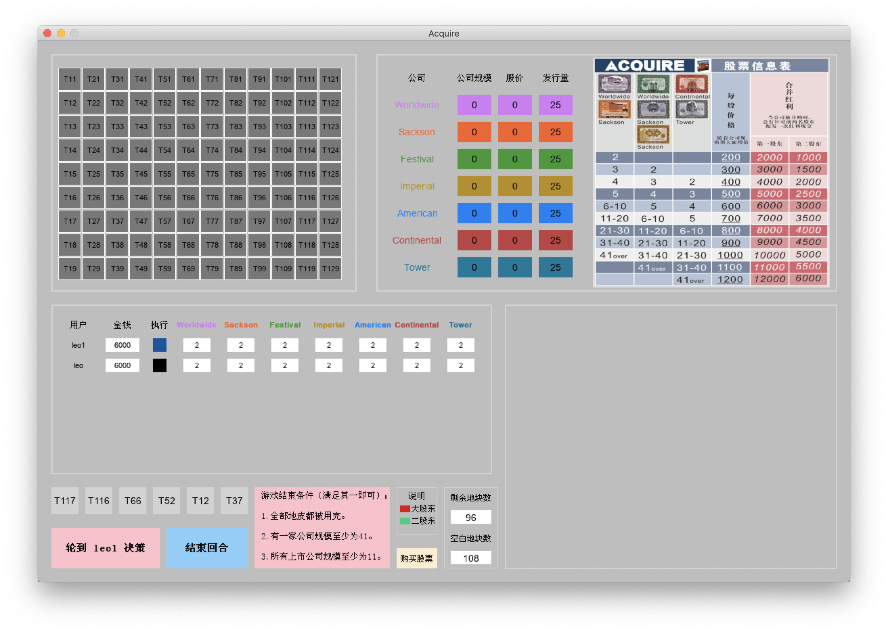

# 并购游戏
### 作者：wanpiqiu123
### 项目简介：
使用pygame编写图形界面，通过socket通信同步游戏数据，从而实现局域网内游戏。目前没有AI，只支持多人游戏。
### 游戏简介：
放置地块，建立并扩张酒店，购买股票从而获得最多资产

  

### 游戏步骤：

1. 运行**server.py**作为服务器，设置服务器的ip地址及游戏人数。等待用户连接。
2. 每个玩家运行**main.py**，输入名称和服务器的ip地址，按下**connect**进行连接。显示**Success**即为连接成功。所有用户都连接成功时，出现**Ready**，按下**confirm**开始游戏。

    

3. 进入界面后，按照顺序轮流进行操作。首先*放置地块*，根据所放地块可能产生*建立公司*或*并购*效果并进行结算。之后可以购买股票（如果有成立的公司）。

4. 当有一家公司规模大于等于41，或所有公司均为安全公司（规模超过11）时游戏结束。计算分红，并根据玩家手中的股票和资金计算总资产，进行排名。
